# Module 12: Virtual Class II Lesson Plan (2 hours)

## Overview

The goal of this session is to explain how to handle imbalanced classification problems with resampling.

Prior to the two hour class time starting, there will be 30 minutes of office hours.

In the first section of class, you will explain and demonstrate K Nearest Neighbors.

The middle section of the class will focus on using resampling methods to handle class imbalance.

The final section of class time will demonstrate the use of the balanced random forest classifier.

## Learning Objectives

By the end of the session, learners will be able to do the following:

* Apply common resampling methods to deal with class imbalance.

* Determine the optimal model and resampler combination for an arbitrary dataset.

---

## Time Tracker

| Start   | #  | Activity                                           | Time |
| ------- | -- | -------------------------------------------------- | ---- |
| 7:00 PM | 1  | Instructor Do: K Nearest Neighbors                 | 0:10 |
| 7:10 PM | 2  | Student Do: K Nearest Neighbors                    | 0:20 |
| 7:30 PM | 3  | Instructor Do: Review K Nearest Neighbors          | 0:10 |
| 7:40 PM | 4  | Instructor Do: Random Resampling                   | 0:10 |
| 7:50 PM | 5  | Student Do: Random Resampling                      | 0:20 |
| 8:10 PM | 6  | Instructor Do: Review Random Resampling            | 0:10 |
| 8:20 PM | 7  | Instructor Do: Synthetic Resampling                | 0:10 |
| 8:30 PM | 8  | Student Do: Synthetic Resampling                   | 0:20 |
| 8:50 PM | 9  | Instructor Do: Review Synthetic Resampling         | 0:10 |
|         | 10 | Optional -Instructor Do: Balanced Random Forest    |      |
| 9:00 PM |    | END                                                |      |

---

## Instructor Do: Office Hours (0:30)

Welcome to Office Hours! Remind the students that this is their time to ask questions and get assistance from their instructional staff as they’re learning new concepts and working on the challenge assignment. Feel free to use breakout rooms to create spaces focused on specific topics, or to have 1:1s with students.
Expect that students may ask for assistance such as the following:

* Challenge assignment
* Further review on a particular subject
* Debugging assistance
* Help with computer issues
* Guidance with a particular tool

---

## Class Activities

### 1. Instructor Do: K Nearest Neighbors (10 min)

**Files:**

[credit_data.csv](./Activities/01_Ins_KNN/Resources/credit_data.csv)

[knn.ipynb](./Activities/01_Ins_KNN/Solved/knn.ipynb)

In this section you will introduce the K Nearest Neighbors algorithm. Highlight the following points:

* K nearest neighbor says let's decide your class label by looking at those around you.

* We choose to classify an **unknown point** by averaging the known label values around it.

* Closer points are weighted such that they contribute more to the average than distant points.

* We can use any metric for distance, but the most common is to use the [Pythagorean theorem](https://en.wikipedia.org/wiki/Pythagorean_theorem).

Review the following image:

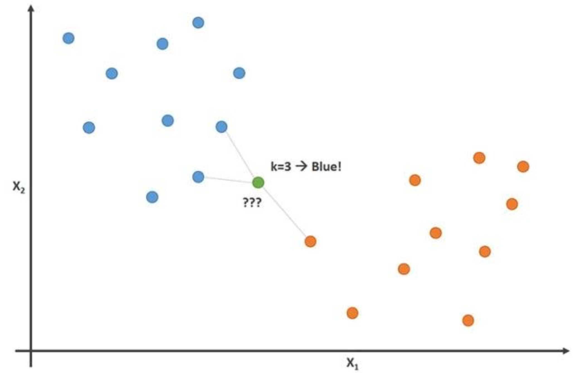

* Since KNN is distanced based, it must be scaled otherwise a feature that is of higher magnitude than any others will have a greater influence on the distance calculation.

Review the following table of car age in years and miles driven:


Consider that we were trying to find the condition for a car that is 5 years old. Using K Nearest Neighbor we could average the distance of the points around it, the cars with an age of 10 and 1 years, and their respective mileage information.

* The calculation is then:

```text
sqrt( (10 - 1)^2 + (100,000 - 10,000)^2 ) = sqrt( 9^2 + 90,000^2 ).
```

* Since 90,000 is much bigger than 9 it will have the most influence in the distance. But we want both features to have an equal weight in determining if the car is in a good or bad condition. We can get around this by scaling the data to a normal distribution. This will make sure that both features are of the same magnitude and play an equal role in determining the average value for the label.

Open a new notebook and add the following imports:

Apply the same concept of determing the condition of a 5 year-old train car to a dataset containing credit application data and a bank's decision regarding the outcome. The target of the analysis is predicting the `credit_risk`.

  ```python
  # Import Modules
  import pandas as pd
  from pathlib import Path
  from sklearn.neighbors import KNeighborsClassifier
  from sklearn.model_selection import train_test_split
  from sklearn.metrics import confusion_matrix
  from sklearn.preprocessing import StandardScaler

  # Read the CSV file into a Pandas DataFrame
  df = pd.read_csv(
      Path('../Resources/credit_data.csv')
  )
  df.head()
  ```

Split the target column from the dataset and then encode the categorical values.

  ```python
  # Split target column from dataset
  y = df['credit_risk']
  X = df.drop(columns='credit_risk')

  # Preview the data
  X[:5]

  # Print first five entries for target
  y[:5]
  ```

* Many of the columns contain categorical values that we will need to one-hot encoded before the model can be fitted. We will use pandas `get_dummies()` to encode the values.
  * >**Note**: `get_dummies()` must be used before the data is split into training and testing sets. Since one-hot encoding produces a vector the same size as the distinct categorical values, we can run into a problem trying to encode after splitting. It could be the case with imbalanced datasets that the testing data, being a smaller sample, could not contain one of the categorical values and the size of the dataset would be different than the training set.

```python
# Encode the categorical variables using get_dummies
X = pd.get_dummies(X)

# Preview the data
X.head()
```

  * Point out to students that whenever we create dummy variables, we need to be mindful of the so called 'dummy variable trap'. If 2 variables are perfectly correlated, the algorithm can't tell apart which one of the variables caused the change in the dependent variable. You can use the 2 examples below to illustrate this problem:

    * **Perfect Positive Correlation**: Suppose a person is lactose intolerant but not aware of this condition and eats cereal with milk every morning. Now after experiencing digestive problems, it would be impossible for a machine learning algorithm to identify the milk as the culprit since both the milk and cereal are always consumed together. We would have run additional tests to disentangle both by consuming only cereal on some days and only milk on others. But with a given dataset, we oftentimes don't have the ability to run additional tests.

    * **Perfect Negative Correlation**: If a person decides to lose weight by skipping lunch and working out instead and loses weight successfully, our algorithm won't be able to tell whether the weight loss was caused by working out or by not eating lunch because whenever the person worked out, they skipped lunch, and whenever the person didn't work out, they ate lunch.

  * We can circumvent this problem by dropping one of the variables, making that the reference or base case, and then estimating the effect when the other variables return 1.

  * Mention to students that the 'get_dummies' function has an argument specifically created for this purpose, which is 'False' by default: 'drop_first'.

Now split the data into the testing and training sets. Check that the shapes are the same between the testing and training sets.

  ```python
  # Split the dataset
  X_train, X_test, y_train, y_test = train_test_split(X, y, random_state=1)

  X_train.shape

  X_test.shape
  ```

The `StandardScaler` available in `sklearn` provides an easy way to scale the data. We must first fit the scaler and then use it to transform our datasets.

  * `train_test_split()` randomly samples from our original dataset and returns 75% of the data for the training set and the remaining 25% for the testing set. The ratios can be changed, but these are the default values.

  ```python
  # Scale the data
  scaler = StandardScaler()
  X_scaler = scaler.fit(X_train)
  X_train_scaled = X_scaler.transform(X_train)
  X_test_scaled = X_scaler.transform(X_test)
  ```

Import the `KNeighborsClassifier` model, fit it, and generate the predicted labels.

  * The `KNeighborsClassifier` model accepts the parameter `n_neighbors` which tells how many neighbors should be used in the averaging calculation. This is similar to setting the value of lowercase-k where k identified the number of segments in the dataset.

  ```python
  # Instantiate the model with k = 3 neighbors
  model = KNeighborsClassifier(n_neighbors=3)

  # Train the model
  model.fit(X_train_scaled, y_train)

  # Create predictions
  y_pred = model.predict(X_test_scaled)

  # Review the predictions
  y_pred
  ```

**Question**: How do we know how well this model performs at predicting this dataset?

**Answer**: We can count the number of times it predicted each one of the labels right or wrong. These counts can be summarized in a table called a confusion matrix. The accuracy, precision and recall can be evaluated with the classification report.

  ```python
  # Print confusion matrix
  confusion_matrix(y_pred,y_test)

  # Print classification report
  print(classification_report(y_pred,y_test))
  ```

Ask students if they have any questions about K nearest neighbors before moving on.

### 2. Student Do: K Nearest Neighbors (20 min)

In this activity students will use the provided dataset of a bank's telemarketing campaign. The bank's marketing partner ran the campaign and the bank has labeled the customers that opened an account after receiving a phone call. Now they want a model that will help them to identify customers so they can provide the marketer with a better list of potential customers in the future.

Slack out the following files to the students.

**Files:**

[Instructions](./Activities/02_Stu_KNN/README.md)

[bank.csv](./Activities/02_Stu_KNN/Resources/bank.csv)

[Starter Code](./Activities/02_Stu_KNN/Unsolved/knn.ipynb)

**Instructions:**

1. Read the CSV file into a Pandas DataFrame.

2. Separate the features `X` from the target `y`.

3. Encode the categorical variables from the features data using [`get_dummies`](https://pandas.pydata.org/pandas-docs/stable/reference/api/pandas.get_dummies.html).

4. Separate the data into training and testing subsets.

5. Scale the data using [`StandardScaler`](https://scikit-learn.org/stable/modules/generated/sklearn.preprocessing.StandardScaler.html)

6. Instantiate an K Nearest Neighbor Classifier instance.

7. Fit the model using the training data.

8. Make predictions using the testing data.

9. Generate the classification report for the test data.

### 3. Instructor Do: Review K Nearest Neighbors (10 min)

**Files:**

[Solution code](./Activities/02_Stu_KNN/Solved/knn.ipynb)

Open the solution and review it with the students being sure to highlight the following points:

* We must encode the categorical variables before we split the testing and training sets.

  ```python
  # Encode the categorical variables using get_dummies
  X = pd.get_dummies(X)

  # Split the dataset
  X_train, X_test, y_train, y_test = train_test_split(X, y, random_state=1)
  ```

* After splitting the data, it must be scaled before being fit to the KNN model.

  ```python
  # Instantiate a StandardScaler instance
  scaler = StandardScaler()

  # Fit the training data to the standard scaler
  X_scaler = scaler.fit(X_train)

  # Transform the training data using the scaler
  X_train_scaled = X_scaler.transform(X_train)

  # Transform the testing data using the scaler
  X_test_scaled = X_scaler.transform(X_test)
  ```

* Using the model-fit-predict pattern, an instance of the `KNeighborsClassifier` module is created with an `n_neighbors` value of 3. Explain that setting the value of n-neighbors is analogous to setting the value of lowercase-k in Unsupervised learning. Next, the model is fit using the `X_train_scaled` and `y_train` data. Finally, we generate the predicted values. The classification report is used to analyze how well the model performed.

  ```python
  # Instantiate the model with k = 3 neighbors
  knn = KNeighborsClassifier(n_neighbors=3)

  # Train the model
  knn.fit(X_train_scaled, y_train)

  # Create predictions
  y_pred = knn.predict(X_test_scaled)

  # Model metrics
  print(classification_report(y_test, y_pred))
  ```

Ask students if they have any questions about the `KNeighborsClassifier` module before moving on to the next section.

### 4. Instructor Do: Random Resampling (10 min)

**Files:**

[random_resampling.ipynb](./Activities/03_Ins_Random_Resampling/Solved/random_resampling.ipynb)

Begin this section by introducing the problem of **class imbalance** and resampling methods:

* **Class imbalance** refers to a situation in which the existing classes in a dataset aren't equally represented. Consider a fraud detection scenario in which a large number of credit card transactions are legitimate, and only a small number are fraudulent. For example, let's say that out of 100,000 transactions, 50 are fraudulent and the rest are legitimate. The pronounced imbalance between the two classes (fraudulent and non-fraudulent) can cause machine learning models to be biased toward the majority class. In such a case, the model will be much better at predicting non-fraudulent transactions than fraudulent ones. This is a problem if the goal is to detect fraudulent transactions!

  > **Note**: In the machine learning field, people often refer to the larger class as the **majority** class and to the smaller class as the **minority** class.

Most of these techniques fall into the following two categories:

  * **Oversampling**: Creating more instances of a class label, usually for the smaller class. Share the following image illustrating oversampling:

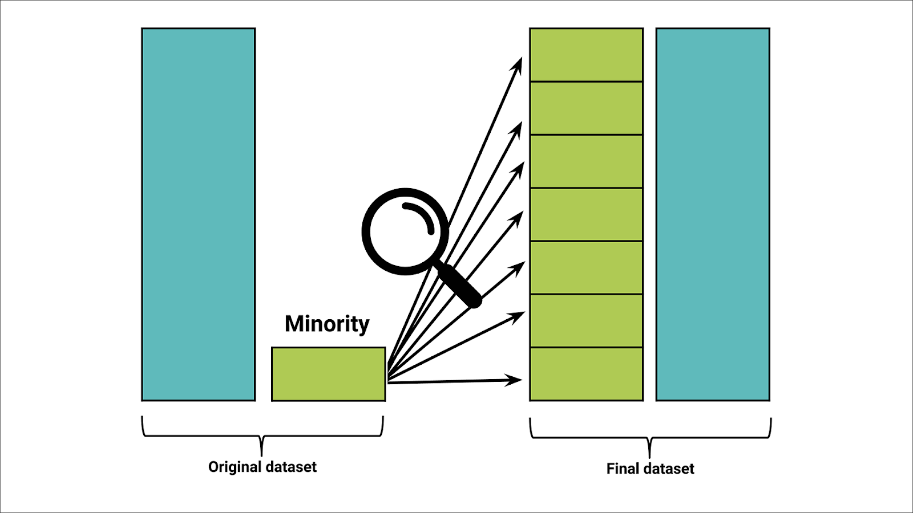

  * **Undersampling**: Creating fewer instances of a class label, usually for the larger class. Undersampling is practical only when enough data exists in the training dataset. The undersampled majority class must have enough usable data for a model to prove useful.  Share the following image illustrating undersampling:

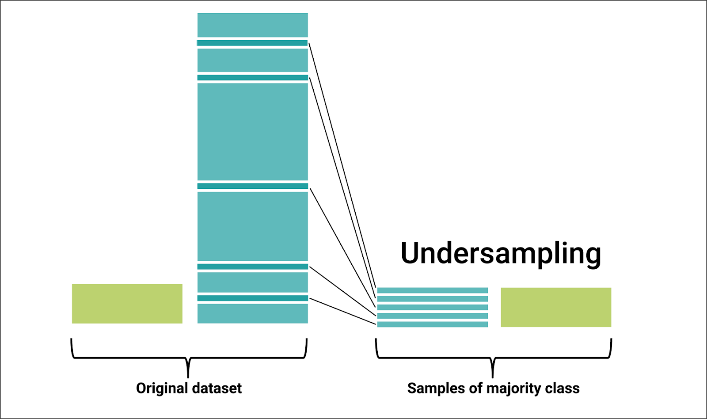

  * Highlight that oversampling addresses imbalanced classes by duplicating existing data. By contrast, undersampling uses only existing data.

  * Oversampling and undersampling can be combined into **combination sampling** as we will soon see.


We will look at two methods commonly used to obtain new samples:

  * **Random Sampling** - Existing instances are chosen at random from the existing dataset. We can use either **oversampling** or **undersampling** when sampling randomly but we are using existing instances in our dataset and not creating new ones.

  * **Synthetic Sampling** - New instances are generated from observations about existing data. For example in our car condition example previously, if we wanted to add a car that was five years old we could use K Nearest Neighbors to approximate what that car would look like. We would then generate a point **synthetically** that was not in our original dataset.

Share the following image that shows the set of sampling techniques that we’ll learn in this lesson, categorized by type:

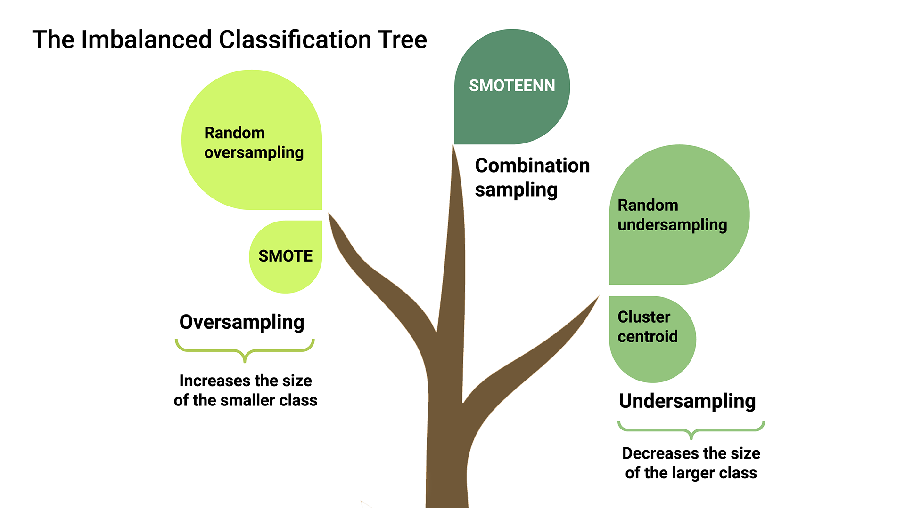

As the image shows, we’ll learn about the following techniques specifically:

* Oversampling techniques:

  * Random oversampling

  * Synthetic minority oversampling technique (SMOTE)

* Undersampling techniques:

  * Random undersampling

  * Cluster centroid

* Combination sampling technique:

  * SMOTE and edited nearest neighbors (ENN), or SMOTEENN


Open a new notebook and import the following modules:

* We will use `make_blobs()` to generate a dataset with extreme class imbalance. This will exaggerate the effects of the resampling methods. Real world datasets will usually not have such an extreme case but it's useful for the demonstration.

* The dataset has two clusters, one has 5000 instances and the other has 50. A large standard deviation gives lots of overlap.

* We will plot the target labels by passing in the target column for the `c` parameter in the scatter plot.

* We will compare the random forest on each resampled dataset we cover.

```python
# Import modules
import pandas as pd
import matplotlib.pyplot as plt
from sklearn.datasets import make_blobs
from sklearn.model_selection import train_test_split
from sklearn.ensemble import RandomForestClassifier
from sklearn.metrics import classification_report

# Generate Data
X, y = make_blobs(n_samples=[5000, 50], random_state=1, cluster_std=7)

# Convert ndarray to pandas datatypes
X = pd.DataFrame(X)
y = pd.Series(y)

# Plot data
plt.scatter(
    x=X[0],
    y=X[1],
    c=y)
plt.show()

# Split data
X_train, X_test, y_train, y_test = train_test_split(X, y, random_state=1)

# Count distinct values
y_train.value_counts()
```

> **Note**: We don't need to scale and normalize the data from `make_blobs`. The dataset is returned normalized.

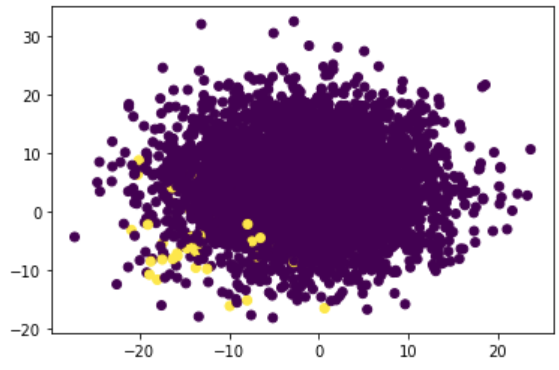

 * Highlight that the values of the target dataset are quite imbalanced with 3753 observations in the majority class and only 34 in the minority class.

 ```text
 0   3753
 1     34
 dtype: int64
 ```

With the features and targets datasets in place, we can being our to address our sampling issues.
#### Random Undersampling

Explain to the class that:

* **Random undersampling** removes randomly selected instances from the majority class until the size of that class is reduced, typically to the size of the minority class.  In class imbalance problems one way we measure the success of a model is by how well it found instances of the minority class.

* Remind students that **precision** calculates the number of false positives that the model produced relative to the total number of instances.

* The **recall** calculates the ratio of the known values from the testing dataset to the values that the model failed to predict.

Add the following code to the notebook:

  ```python
  # Import RandomUnderSampler from imblearn
  from imblearn.under_sampling import RandomUnderSampler

  # Instantiate the RandomUnderSampler instance
  rus = RandomUnderSampler(random_state=1)

  # Fit the data to the model
  X_resampled, y_resampled = rus.fit_resample(X_train, y_train)

  # Count distinct values
  y_resampled.value_counts()
  ```

  * We import the `RandomUnderSampler` from `imblearn.under_sampling` which you can read more about on the [documentation page](https://imbalanced-learn.org/stable/references/generated/imblearn.under_sampling.RandomUnderSampler.html).

  * The minority class is value 1. In the original dataset we had 3753 vs 34 instances in the training set. We see with `value_counts` that the resampled sets are equal at 34 observations each.

  * The `RandomUnderSampler` model randomly chose which of the majority class labels not to keep until it was the same size as the minority class.


Now explain the following points and add the below code:

* We fit a random forest classifier to the resampled dataset. Then we generate a set of test predictions for the original training set.

* Looking at the plots of the `y_pred` and `y_pred_resampled` we see that `y_pred_resampled` identified many more points as being part of the minority class. Looking at the two classification reports, the recall has gone up considerably for the minority class. We went from capturing 6% of the known minority class labels to 81% by allowing more false positives.

* This may seem counter intuitive, but the way scoring and accuracy metrics are calculated may not apply to the business need. Consider a bank that is wanting to automate a text verification system to ask customers if the last transaction they made was fraudulent. The desirable behavior would be for the front line text to go out to more people knowing you are more likely to catch the fraudulent transactions. If a customer responds yes, then a human may intervene.

  ```python
  # Instantiate an initial RamdonForestClassifier instance
  model = RandomForestClassifier()

  # Fit the initial model based the training data
  model.fit(X_train, y_train)
  ```

  ```python
  # Instantiate a second RamdonForestClassifier instance
  model_resampled = RandomForestClassifier()

  # Fit the second model based the resampled data
  model_resampled.fit(X_resampled, y_resampled)
  ```

  ```python
  # Make predictions using the initial model
  y_pred = model.predict(X_test)

  # Make predictions using the model based on the resampled data
  y_pred_resampled = model_resampled.predict(X_test)

  # Plot the data using the original y_test information
  plt.scatter(
      x=X_test[0],
      y=X_test[1],
      c=y_test)
  plt.show()

  # Plot the data using the predictions based on the original test data
  plt.scatter(
      x=X_test[0],
      y=X_test[1],
      c=y_pred)
  plt.show()

  # Plot the data using the predictions based on the resampled test data
  plt.scatter(
      x=X_test[0],
      y=X_test[1],
      c=y_pred_resampled)
  plt.show()
  ```

The following image shows the plot based on the  resampled data

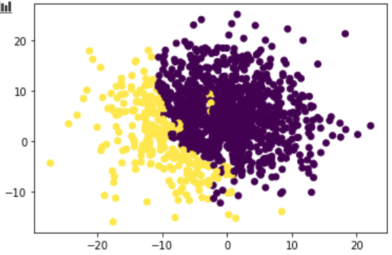

Print the classification reports:

  ```python
  # Print classification report
  print(classification_report(y_test, y_pred))
  print(classification_report(y_test, y_pred_resampled))
  ```

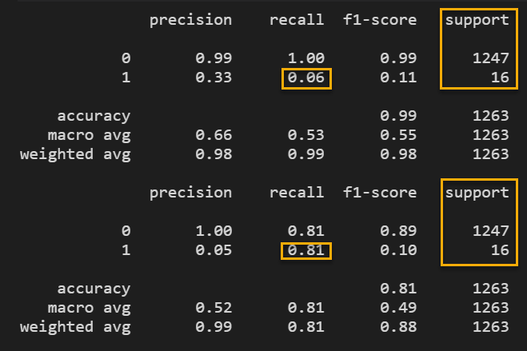

* **Note:** Your notebook output may vary from the image above. When describing the classification report output, use the following statement as a guide, but tailor your description according to your particular results:

  * We found 81% of the minority labels but we were right only 5% of the time. Definitely not the best outcome. 

Explain that we can contrast the outcome from random undersampling with random oversampling, by generating and evaluating observations using that methodology.

#### Random Oversampling

Now we will look at **random oversampling**:

* In **random oversampling**, instances of the minority class are randomly selected and added to the training set until the majority and minority classes are balanced.

* It may be necessary to test different resampling methods and model combinations for a dataset.

* We will use the `RandomOverSampler` from `imblearn.over_sampling` which you can read more about on the [documentation page](https://imbalanced-learn.org/stable/references/generated/imblearn.over_sampling.RandomOverSampler.html).

Add the following code:

* Looking at the value counts, we see that the minority class instance had lower recall compared to the random undersampler but it was more precise.

* We didn't catch as many of the minority class but we didn't get as many false positives, we were more precise.

* Which resampler performs better can be very dependent on the business case.

  ```python
  # Import RandomOverSampler from imblearn
  from imblearn.over_sampling import RandomOverSampler

  # Instantiate the RandomOverSampler instance
  random_oversampler = RandomOverSampler(random_state=1)

  # Fit the data to the model
  X_resampled, y_resampled = random_oversampler.fit_resample(X_train, y_train)

  # Count distinct values
  y_resampled.value_counts()
  ```

You will note that, after oversampling, the result of the value counts is still equal between the majority and minority class, but the values are vastly different.

  ```text
  1  3753
  0  3753
  dtype: int64
  ```

As with undersampling, create two RandomForestClassifier models, one using the origina data and the other using the oversampled data. Then generate the predictions and and compare the results.

```python
# Create a RandomForestClassifier instance and fit it to the original data
model = RandomForestClassifier()
model.fit(X_train, y_train)

# Create a RandomForestClassifier instance and fit it to the resampled data
model_resampled = RandomForestClassifier()
model_resampled.fit(X_resampled, y_resampled)

# Make predictions for testing features
y_pred = model.predict(X_test)
y_pred_resampled = model_resampled.predict(X_test)

# Print the classification reports for the two models
print(classification_report(y_test, y_pred))
print(classification_report(y_test, y_pred_resampled))
```


* **Note:** Your notebook output may vary from the image above. When describing the classification report output, use the following statement as a guide, but tailor your description according to your particular results:

  * Using oversampling to rectify the imbalance, we found only 19% of the minority class instances, but we were right 43% of the time. Compare this to the predictions using undersampling where we found 81% f the minority class instances, but were right only 5% of the time. Regardless of the different outcomes, both undersampling and oversampling improved the results over the original data.

Ask students if they have any questions about random undersampling or randome oversampling before moving on to the next activity.

### 5. Student Do: Random Resampling (20 min)

In this activity students will use the provided dataset of a bank's telemarketing campaign. They will compare the effectiveness of random resampling methods using a random forest. They will then measure the random forest's recall of the minority class for both a random forest fitted to the resampled data and the original dataset.

Slack out the following files to the students.

**Files:**

[Instructions](./Activities/04_Stu_Random_Resampling/README.md)

[bank.csv](./Activities/04_Stu_Random_Resampling/Resources/bank.csv)

[Starter Code](./Activities/04_Stu_Random_Resampling/Unsolved/random_resampling.ipynb)

**Instructions:**

1. Read the CSV file into a Pandas DataFrame.

2. Separate the features `X` from the target `y`.

3. Encode the categorical variables from the features data using [`get_dummies`](https://pandas.pydata.org/pandas-docs/stable/reference/api/pandas.get_dummies.html).

4. Separate the data into training and testing subsets.

5. Scale the data using [`StandardScaler`](https://scikit-learn.org/stable/modules/generated/sklearn.preprocessing.StandardScaler.html)

**RandomForestClassifier**

6. Create and fit a `RandomForestClassifier` to the **scaled** training data.

7.  Make predictions using the scaled testing data.

**Random Undersampler**

8. Import `RandomUnderSampler` from `imblearn`.

9. Fit the random undersampler to the scaled training data.

10. Check the `value_counts` for the resampled target.

11. Create and fit a `RandomForestClassifier` to the **undersampled** training data.

12. Make predictions using the scaled testing data.

13. Generate and compare classification reports for each model.

**Random Oversampler**

14. Import `RandomOverSampler` from `imblearn`.

15. Fit the random over sampler to the scaled training data.

16. Check the `value_counts` for the resampled target.

17. Create and fit a `RandomForestClassifier` to the **oversampled** training data.

18. Make predictions using the scaled testing data.

19. Generate and compare classification reports for each model.

### 6. Instructor Do: Review Random Resampling (10 mins)

Review the following solution file with the students:

**Files:**

[Solution Code](./Activities/04_Stu_Random_Resampling/Solved/random_resampling.ipynb)

Start the review of this activity by asking the following question:

**Question** What is a categorical variable and what do we need to do before we can fit a model to a dataset with categorical variables?

**Answer** Categorical variables are discrete variable types. They have a fixed number of indivisible values. In the bank dataset `default` and `housing` are examples of categorical variables. We need to one-hot encode any categorical variable before fitting a model. Once the features and target datasets have been created, we can update the categorical variables in the features dataset using the Pandas `get_dummies` function.

  ```python
  # Encode the features dataset's categorical variables using get_dummies
  X = pd.get_dummies(X)

  # Review the features DataFrame
  X.head()
  ```

After the categorical variables have been handled and the data has been split into testing and training datasets, the next step is to scale the data using `StandarScaler`.

  ```python
  # Split data into training and testing datasets
  X_train, X_test, y_train, y_test = train_test_split(X, y, random_state=1)

  # Review the distinct values from y
  y_train.value_counts()

  # Instantiate a StandardScaler instance
  scaler = StandardScaler()

  # Fit the training data to the standard scaler
  X_scaler = scaler.fit(X_train)

  # Transform the training data using the scaler
  X_train_scaled = X_scaler.transform(X_train)

  # Transform the testing data using the scaler
  X_test_scaled = X_scaler.transform(X_test)
  ```

Finally, we can generate a RandomForestClassifier model and make predictions based on the original data.

  ```python
  # Import the RandomForestClassifier from sklearn
  from sklearn.ensemble import RandomForestClassifier

  # Instantiate a RandomForestClassifier instance
  model = RandomForestClassifier()

  # Fit the traning data to the model
  model.fit(X_train_scaled, y_train)

  # Predict labels for original scaled testing features
  y_pred = model.predict(X_test_scaled)
  ```

Next, random undersampler and random oversampler models are created that will resample the datasets. These resampled datasets are then used to fit another instance of the random forrest classifier to make predictions.

* The code to make predictions using RandomUnderSampler is as follows. Be sure to point out how the distinct value counts associated with the target have changed.

  ```python
  # Import RandomUnderSampler from imblearn
  from imblearn.under_sampling import RandomUnderSampler

  # Instantiate a RandomUnderSampler instance
  rus = RandomUnderSampler(random_state=1)

  # Fit the training data to the random undersampler model
  X_undersampled, y_undersampled = rus.fit_resample(X_train_scaled, y_train)

  # Count distinct values for the resampled target data
  y_undersampled.value_counts()

  # Instantiate a new RandomForestClassier model to the undersampled data
  model_undersampled = RandomForestClassifier()

  # Fit the undersampled data the new model
  model_undersampled.fit(X_undersampled, y_undersampled)
  ```

  * In both resampling instances there was an increase in the recall for the minority class which is the result we want to see. (Your output may vary from the image below.)

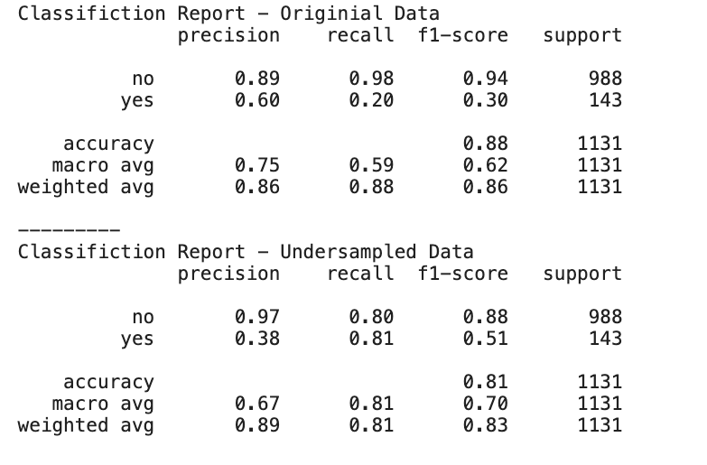

* Confirm that the code to resample the data using random oversampler is quite similar. Be sure to point out how the distinct value counts associated with the target have changed once again.

  ```python
  # Import RandomOverSampler from imblearn
  from imblearn.over_sampling import RandomOverSampler

  # Instantiate a RandomOversampler instance
  ros = RandomOverSampler(random_state=1)

  # Fit the model to the traning data
  X_oversampled, y_oversampled = ros.fit_resample(X_train_scaled, y_train)

  # Count distinct values
  y_oversampled.value_counts()

  # Instantiate a new RandomForestClassier model to the oversampled data
  model_oversampled = RandomForestClassifier()

  # Fit the oversampled data the new model
  model_oversampled.fit(X_oversampled, y_oversampled)

  # Predict labels for oversampled testing features
  y_pred_oversampled = model_oversampled.predict(X_test_scaled)
  ```

* As in the demo, random oversampling proved better in one metric, but not as strong in another. (Your output may vary from the image below.)

  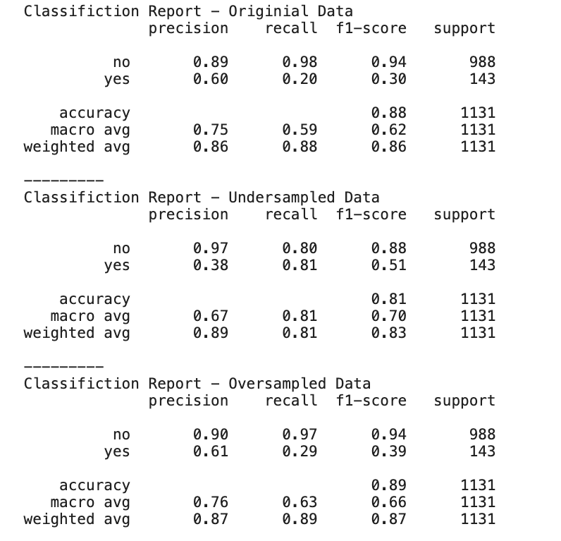

Ask the students if they have any questions about random oversampling and random undersampling before moving on to the next activity.
### 7. Instructor Do: Synthetic Resampling (10 min)

In this activity you will demo the following synthetic resampling methods:

* Cluster Centroids

* SMOTE (Synthetic Minority Oversampling Technique)

* SMOTEENN (SMOTE + Edited NearestNeighbors)

Synthetic sampling creates new data points from existing observations. There are several ways that we can go about this but the most common approach is to use K-NearestNeighbors (KNN) to generate the new points. The general idea is that the algorithm will identify clusters of points that are around a mean value, similar to K-Means that you learned about in unsupervised learning. Once the cluster has been identified K-NearestNeighbors is used to generate new points in the cluster.

**Files:**

[synthetic_resampling.ipynb](./Activities/05_Ins_Synthetic_Resampling/Solved/synthetic_resampling.ipynb)

Open a notebook and create a dataset using `make_blobs`:

  ```python
  # Import modules
  import pandas as pd
  import matplotlib.pyplot as plt
  from sklearn.datasets import make_blobs
  from sklearn.model_selection import train_test_split
  from sklearn.ensemble import RandomForestClassifier
  from sklearn.metrics import classification_report

  # Generate Data
  X, y = make_blobs(n_samples=[5000, 50], random_state=1, cluster_std=7)

  # Convert ndarray to pandas datatypes
  X = pd.DataFrame(X)
  y = pd.Series(y)

  # Plot data
  plt.scatter(
      x=X[0],
      y=X[1],
      c=y)
  plt.show()

  # Split data
  X_train, X_test, y_train, y_test = train_test_split(X, y, random_state=1)

  # Count distinct values
  y_train.value_counts()
  ```

The resulting plot and data point should illustrate an imbalanced data set in favor of the 0 class.

  ```text
  0    3753
  1      34
  dtype: int64
  ```


#### Cluster Centroids

Explain to students the following points:

* In both of the random sampling methods we discussed in the prior section, we randomly chose points to add or remove.

* Cluster Centroids is a synthetic method of resampling the data to achieve a balance between what started as the majority and minority class.

* We identify the the center of a cluster of the majority class then generate points in that cluster using K-NearestNeighbors.

* These generated points are then **undersampled** until there are an equivalent number of instances as the minority class.

To accomplish this, we use the `ClusterCentroids` model from `imblearn.under_sampling` which you can read more about on the [documentation page](https://imbalanced-learn.org/stable/references/generated/imblearn.under_sampling.ClusterCentroids.html).

Add the following lines of code:

  ```python
  # Import ClusterCentroids from imblearn
  from imblearn.under_sampling import ClusterCentroids

  # Create an instance of ClusterCentroids
  cc = ClusterCentroids(random_state=1)

  # Fit the cluster centroids model to the traning data
  X_resampled, y_resampled = cc.fit_resample(X_train, y_train)

  # Count resampled values
  y_resampled.value_counts()
  ```

  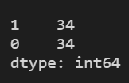

Once we have our resampled data, the next step is to instantiate the RandomForrestClassifier model, fit the models,  and analyze the classification reports on the predicted values:

  ```python
  # Fit the RandomForestClassifier on the original data
  model = RandomForestClassifier()
  model.fit(X_train, y_train)

  # Fit the RandomForestClassifier on the resampled data
  model_resampled = RandomForestClassifier()
  model_resampled.fit(X_resampled, y_resampled)

  # Generate predictions based on the original data model
  y_pred = model.predict(X_test)

  # Generate predictions based on the resampled data model
  y_pred_resampled = model_resampled.predict(X_test)

  # Print classification reports
  print(classification_report(y_test, y_pred))
  print(classification_report(y_test, y_pred_resampled))
  ```

* Although the accuracy with the resampled data was not an improvement, the resampled model using cluster centroids did provide some improvement for making precidction regarding the 1 class. (Your output may vary from the image below.)

  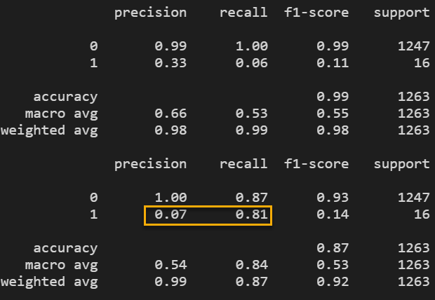

Overall the performance using CentroidClusters looks very similar to that using the RandomUnderSampler.

Keep in mind that our synthetic data generated make_blobs is derived from a normal distribution. Real world datasets may NOT be normally distributed and different performance of different resampling methods will vary.

#### SMOTE

[SMOTE.pdf](./Activities/05_Ins_Synthetic_Resampling/Resources/SMOTE.pdf)


SMOTE, the Synthetic Minority Oversampling Technique, is another synthetic resampling technique. It works by again using K-NearestNeighbors to generate synthetic data. Only this time, the synthetic points are from the minority class.

The the set of synthetic points from the minority class is oversampled until it is of the same size as the majority class.

* You can read more about it on the [documentation page](https://imbalanced-learn.org/stable/over_sampling.html#from-random-over-sampling-to-smote-and-adasyn).

Add the following code:

```python
# Import SMOTE from imblearn
from imblearn.over_sampling import SMOTE

# Instantiate the SMOTE model instance
smote_sampler = SMOTE(random_state=1, sampling_strategy='auto')

# Fit the SMOTE model to the training data
X_resampled, y_resampled = smote_sampler.fit_resample(X_train, y_train)

# Count resampled values
y_resampled.value_counts()
```

* Note the addition of the parameter `sampling_strategy='auto'` when instantiating the SMOTE instance. This allows the algorithm to automatically re-sample the training data set. This in contrast to specifying the nubmer of elements in each class.

* We can see from the value counts that SMOTE is an oversampling method.

  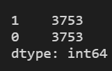


  ```python
  # Fit the RandomForestClassifier on the original data
  model = RandomForestClassifier()
  model.fit(X_train, y_train)

  # Fit the RandomForestClassifier on the resampled data
  model_resampled = RandomForestClassifier()
  model_resampled.fit(X_resampled, y_resampled)

  # Generate predictions based on the original data model
  y_pred = model.predict(X_test)

  # Generate predictions based on the resampled data model
  y_pred_resampled = model_resampled.predict(X_test)

  # Print classification reports
  print(classification_report(y_test, y_pred))
  print(classification_report(y_test, y_pred_resampled))
  ```

  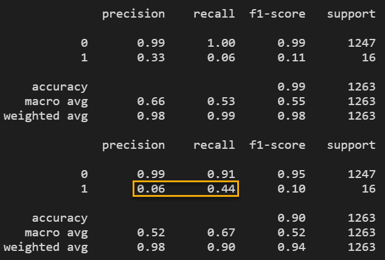

* Smote did help but it's results were not the best that we have see for this dataset. That does not mean it performs worse on average. It simply means that for this synthetic dataset, it did not perform as well as undersampling with Cluster Centroids or, in term of precision, the RandomOverSampler model. (Your output may vary from the image above.)

#### SMOTEENN

SMOTEENN is a combination of SMOTE oversampling and undersampling by removing misclassified points using EditedNearestNeighbors.

* Edited Nearest Neighbors is a rule that uses 3 nearest neighbors to find a misclassified point and remove it. You can read more about imblearn's `EditedNearestNeighbors` implementation on the [documentation page](https://imbalanced-learn.org/stable/references/generated/imblearn.under_sampling.EditedNearestNeighbours.html).

* You can read more about `SMOTEENN` on the [documentation page](https://imbalanced-learn.org/stable/references/generated/imblearn.combine.SMOTEENN.html).

Add the following code to resample the dataset using SMOTEENN:

  ```python
  # Import SMOTEENN from imblearn
  from imblearn.combine import SMOTEENN

  # Instantiate an instance of the SMOTEENN model
  smote_enn = SMOTEENN(random_state=0)

  # Fit the SMOTEENN model to the training data
  X_resampled, y_resampled = smote_enn.fit_resample(X_train, y_train)

  # Count distinct values
  y_resampled.value_counts()
  ```

* Notice that value counts are not even as we have previously seen. This is due to the application of Edited Nearest Neighbors to remove misclassified points.

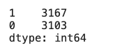


Fit the model and then compare the predicted values of the resampled and original training set.

  ```python
  # Fit random forest on data
  model = RandomForestClassifier()
  model.fit(X_train, y_train)

  # Fit random forest on resampled data
  model_resampled = RandomForestClassifier()
  model_resampled.fit(X_resampled, y_resampled)

  # Generate predictions based on the original data model
  y_pred = model.predict(X_test)

  # Generate predictions based on the resampled data model
  y_pred_resampled = model_resampled.predict(X_test)

  # Print classification reports
  print(classification_report(y_test, y_pred))
  print(classification_report(y_test, y_pred_resampled))
  ```

  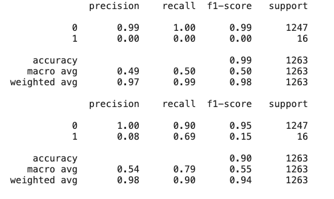

* As we can see by the classification report, SMOTEEN's model performed better that just the SMOTE model alone, but still not as well as the Cluster Cluster centroids. (Your output may vary from the image above.)

Explain to students that the key is knowing the various different resampling techniques that are available. It takes a bit of trial and error, but through the process of resampling the data, fitting the Classifier model, making predictions,  and evaluating the results, it is possible to determine the technique that works best for the data set on which the predictions are being made.

Clarify any questions from the students on Centroid Clusters, SMOTE, and SMOTEEN before moving on to the activity.

### 8. Student Do: Synthetic Resampling (20 mins)

In this activity students will use the provided dataset of a bank's telemarketing campaign. They will compare the effectiveness of synthetic resampling methods using a random forest. They will measure the random forest's recall of the minority class for both a random forest fitted to the resampled data and the original data.

Slack out the following files to the students.

**Files:**

[Instructions](./Activities/06_Stu_Synthetic_Resampling/README.md)

[bank.csv](./Activities/06_Stu_Synthetic_Resampling/Resources/bank.csv)

[Starter Code](./Activities/06_Stu_Synthetic_Resampling/Unsolved/synthetic_resampling.ipynb)

**Instructions:**

1. Read the data into a Pandas DataFrame.

2. Separate the features `X` from the target `y`.

3. Encode the categorical variables from the features data using [`get_dummies`](https://pandas.pydata.org/pandas-docs/stable/reference/api/pandas.get_dummies.html).

4. Separate the data into training and testing subsets.

5. Scale the data using [`StandardScaler`](https://scikit-learn.org/stable/modules/generated/sklearn.preprocessing.StandardScaler.html)

**RandomForestClassifier**

6. Create and fit a `RandomForestClassifier` to the **scaled** training data.

7.  Make predictions using the scaled testing data.

**Cluster Centroids**

8. Import `ClusterCentroids` from `imblearn`.

9. Fit the `ClusterCentroids` model to the scaled training data.

10. Check the `value_counts` for the resampled target.

11. Create and fit a `RandomForestClassifier` to the resampled training data.

12. Make predictions using the scaled testing data.

13. Generate and compare classification reports for each model.

**SMOTE**

14. Import `SMOTE` from `imblearn`.

15. Fit the `SMOTE` model to the scaled training data.

16. Check the `value_counts` for the resampled target.

17. Create and fit a `RandomForestClassifier` to the resampled training data.

18. Make predictions using the scaled testing data.

19. Generate and compare classification reports for each model.

**SMOTEENN**

20. Import `SMOTEENN` from `imblearn`.

21. Fit the `SMOTEENN` model to the scaled training data.

22. Check the `value_counts` for the resampled target.

23. Create and fit a `RandomForestClassifier` to the resampled training data.

24. Make predictions using the scaled testing data.

25. Generate and compare classification reports for each model.

### 9. Instructor Do: Review Synthetic Resampling (10 min)

Review the solution with the students:

**Files:**

[Solution code](./Activities/06_Stu_Synthetic_Resampling/Solved/synthetic_resampling.ipynb)

* The solution code is very similar to the previous activity with the only exception being the resamplers used.

**Question** Please articulate, at a high level, the steps in the process for making predictions with resampled data?

  **Answer** Once the data has been imported, separated into target and feature datasets, encoded, split into training and testing datasets and then scaled (whew!), the work of resampling can begin. It starts with importing the resampling technique, wether it be RandomeOversampler, ClusterCentroids, SMOTE etc. Once the model is imported, the X and y training sets are resampled so that the values counts between the classes is roughly equal. From there, the classifier model is instantiated, fit with the resampled data, predictions are generated and the results reviewed.

Because the process is identical across the board, review the code for just the ClusterCentroids resampling technique.

  ```python
  # Import ClusterCentroids from imblearn
  from imblearn.under_sampling import ClusterCentroids

  # Instantiate a ClusterCentroids instance
  cc_sampler = ClusterCentroids(random_state=1)

  # Fit the training data to the cluster centroids model
  X_resampled, y_resampled = cc_sampler.fit_resample(X_train_scaled, y_train)

  # Count distinct values for the resampled target data
  y_resampled.value_counts()

  # Instantiate a new RandomForestClassier model
  cc_model = RandomForestClassifier()

  # Fit the resampled data the new model
  cc_model.fit(X_resampled, y_resampled)

  # Predict labels for resampled testing features
  cc_y_pred = cc_model.predict(X_test_scaled)

  # Print classification reports
  print(f"Classifiction Report - Original Data")
  print(classification_report(y_test, y_pred))
  print("---------")
  print(f"Classifiction Report - Redsampled Data - CentroidClusters")
  print(classification_report(y_test, cc_y_pred))
  ```

  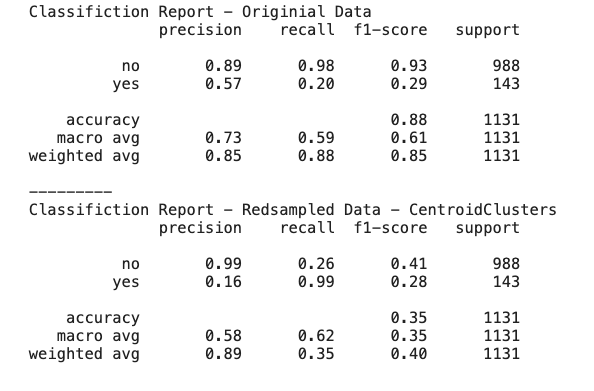

Ask the students if they have any questions about the process for either the SMOTE or SMOTEENN techniques before moving on to the following questions.

The results may vary slightly from the images show above. If they do, use these answers as a guide an tailor your responses appropriately.

**Question:** Which model fitted to the resampled datasets had the best recall for the minority class?

  * **Answer:** Cluster Centroids had a recall of 0.99 though the precision was 0.16. Thinking about a bank wanting to send automated texts to catch fraudulent transactions, this is the best model/resampler combination we have seen for predicting the minority class label. The bank's business case may not care so much about precision as much as catching the fraudulent transactions since they are expensive. Sending out texts that you know 5/6 times the transaction is non-fraudulent but you will catch 99% of fraud cases might make business sense. Keep in mind that in the real world, the models receive new data and are updated as more cases are discovered. Over time it would be expected that the precision will increase once a feedback loop is established.

>This may be fine for the fraudulent transaction business case but our dataset was for **targeted marketing campaigns**. We would not want a precision value so low as calling all the customers would also yield a high recall rate.

**Question:** Which model fitted to the resampled datasets would be the best for targeted marketing campaign?

  * **Answer:** SMOTEENN had the best precision and recall combination overall. It would be the best to prescreen potential customers for a targeted marketing campaign.

**Question:** Which resampler technique/classifier model combination will work best?

  * **Answer:** There will rarely be a case where the optimal combination is apparent beforehand. You will need to experiment and try different combinations to determine what works for a given dataset. The best combination will also depend on the business case. A resampler technique/classifier model combo for one business case may not be acceptable for something else. The key is to know what techniques and classifier models are available so that various combinations can be tested and evaluated so that the optimal one can eventually be found and saved for reuse.

Ask the students if they have any questions about resampling techniques and how they work in conjunction with Classifier models before proceeding to either the end of the class or a quick demonstration of the `BalancedRandomForestClassifier` model.

---

The following activity is optional, and need only be done if time permits.
### 10. Instructor Do: Balanced Random Forest (Optional)

In this section you will demonstrate the balanced random forest classifier:

Within `imblearn` there is a class that implements random undersampling in addition to a random forest classifier called `BalancedRandomForestClassifier`.

* You can read more about it on the [documentation page](https://imbalanced-learn.org/stable/references/generated/imblearn.ensemble.BalancedRandomForestClassifier.html).

**Files:**

[credit_data.csv](./Activities/07_Ins_Balanced_Random_Forest/Resources/credit_data.csv)

[balanced_random_forest.ipynb](./Activities/07_Ins_Balanced_Random_Forest/Solved/balanced_random_forest.ipynb)

Open a new notebook and demonstrate the following code:

```python
# Prepare the data
# Import modules
import pandas as pd
from sklearn.preprocessing import StandardScaler
from sklearn.model_selection import train_test_split
from sklearn.metrics import classification_report

# Read dataset
df = pd.read_csv('../Resources/credit_data.csv')
df.head()

# Split target column from dataset
y = df['credit_risk']
X = df.drop(columns='credit_risk')

# Encode the categorical variables using get_dummies
X = pd.get_dummies(X)

# Split data
X_train, X_test, y_train, y_test = train_test_split(X, y, random_state=1)

# Count distinct values
y_train.value_counts()

# Scale the data
scaler = StandardScaler()
X_scaler = scaler.fit(X_train)
X_train_scaled = X_scaler.transform(X_train)
X_test_scaled = X_scaler.transform(X_test)
```

* We can create an instance of the classifier, fit it to the data and then use it to predict labels from out scaled test data set. It will randomly undersample for us when it is fitted.

```python
# Import BalancedRandomForestClassifier from imblearn
from imblearn.ensemble import BalancedRandomForestClassifier

# Instantiate a BalancedRandomForestClassifier instance
brf = BalancedRandomForestClassifier()

# Fit the model to the training data
brf.fit(X_train_scaled, y_train)

# Predict labels for testing features
y_pred = brf.predict(X_test_scaled)

# Print classification report
print(classification_report(y_test, y_pred))
```

* Highlight, that once again, the process for utilizing a Classifier model is the same (model-fit-predict). Because the BalancedRandomForestClassifier incorporates random undersampling into the algorithm, that does not need to be processed in a separate step.

* Looking at the classification report we can see that the accuracy, precision and recall for both class labels is very good. These are the best results seen so far for this dataset.

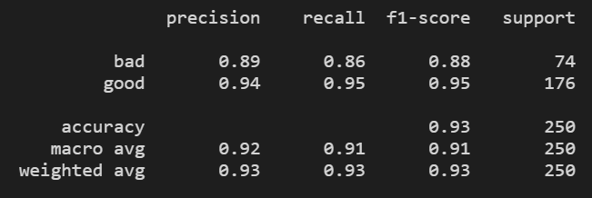

Remind students that office hours will begin next if anyone needs additional support.

---
## Open Office Hours

### Q&A and System Support

This is an opportunity to support students in any way that they require.

* Offer personalized support for students. (**Note:** feel free to pair individual students off with instructional staff as needed.)

* Ask the students if they have any questions about the material covered in today's live lesson.

* Ask students if they have any questions about the material covered in the async content or the Challenge assignment.

* If time did not previously allow, consider offering a brief refresher on working with Git.

---

© 2021 Trilogy Education Services, a 2U, Inc. brand. All Rights Reserved.
